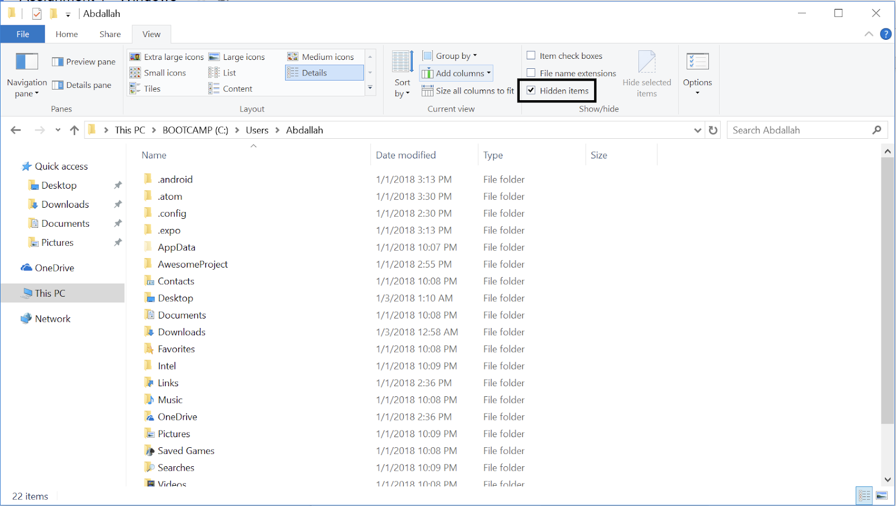

# Warmup Assignment: Setup (for windows)

Due *Due Date*

## Overview

This assignment is just an environment setup. Your task is to follow the steps in this assignment, and make sure that your environment works properly before the deadline. As simple as this assignment may seem, installing required software can be tricky sometimes, and you certainly could face roadblocks. Please try to start the assignment early, and if you have any issues, drop by the office hours on Monday. Of course, feel free to ask friends and peers as much as you would like about the assignment. No honor code violation should be feared :)

## Installation Instructions

(Please note that this is the **Windows** installation instructions. Other operating systems are in different documents)

There are 3 main parts to make sure that you can write and test React Native code:
- Part 1: “Create React Native Apps”, which allows you to build and compile your code.
- Part 2: A word editor to edit the code.
- Part 3: A testing environment, which could be your phone or a simulator.

### Part 1: “Create React Native Apps”

1. Install node:
    1. If you already have node, open your command prompt, and type in “`node -v`”. If your version is at least 10.13.0 but not higher than 11.0.0 OR at least 12.0.0, you can skip the “Install node” step. If your version is outside of these bounds. You will need to uninstall node before moving on to the next step. To remove node:
        1. Uninstall from Programs & Features with the uninstaller.
        2. Reboot your machine.
        3. Look for these folders and remove them (and their contents) if any still exist.
            1. Make sure that you have hidden files showing.
            
            2. `C:\Program Files (x86)\Nodejs`
            3. `C:\Program Files\Nodejs`
            4. `C:\Users\{User}\AppData\Roaming\npm` (or `%appdata%\npm`)
            5. `C:\Users\{User}\AppData\Roaming\npm-cache` (or `%appdata%\npm-cache`)
            6. `C:\Users\{User}\.npmrc`
            7. `C:\Users\{User}\npmrc`
            8. `C:\Users\{User}\AppData\Local\Temp\npm-*`
        4. In the command prompt, type “`where node`”. You should get a message saying “`INFO: Could not find files for the given pattern(s).`”
    2. If you do not already have node, or just deleted your existing version, click [here](https://nodejs.org/en/download/) to download node installer. Follow the steps in the installer; it should be straightforward.
    3. Reboot your device.
2. Run the following line in your command prompt “`npm install -g expo-cli`”. Wait for the command to finish running, and make sure you don’t get any errors.

### Part 2: Download a word editor
This part is up to your own preference. If you already have a word editor you like and prefer, you can use it. Some of the suggested word editors are [Sublime Text](https://www.sublimetext.com/3) and [Atom](https://atom.io/).

### Part 3: Testing Environment

1. Setting up an Android emulator
    1. Head to Android Studio website, and install the [latest Android Studio version available](https://developer.android.com/studio/).
    2. Once installation is done, open Android Studio, and create a new empty project (this project won’t be used).
    3. Next, open the AVD Manager (This is the icon  )
    4. Click on “Create Virtual Device”. Choose “Pixel 2” or “Pixel 3” device and for system image, select “Oreo 26 x86” or higher.
2. Creating a project and running it
    1. Run

        `npm install -g expo-cli`

    2. Run `expo init AppName`. When prompted, choose blank project. Once it’s done, you will have your first React Native project!
    3. To launch the project, execute

        `cd AppName`

        `expo start`

       A browser window should open. This is your running app console.

    4. On your laptop, launch the create Android emulator.
    5. From the browser window that opened, click “Run on Android emulator”.

## Editing the app

Using your preferred text editor, open the App.js file in your project directory. This is your app code. You will see a Text tag saying “Open up App.js to start working on your app!”. Change it to whatever you want, and save the app. You will notice that the emulator immediately restarts.

## Future projects and runs

If you think that the setup is complicated, you are not alone (it took me literally days to figure things out). What’s nice is that future runs will not take anywhere nearly as much. All you need is:

1. Launch Android Studio > AVD Manager > [Any emulator].
2. Open a project or create one using `expo init`.
3. Click “Run on Android emulator”.
4. Start coding!

## Deliverables

Either show up at the office hours on Monday, or send us a screenshot of your phone with the text changed. If you face any roadblocks that you cannot solve by Monday office hours, make sure to stop by for help.

## Notes

1. **Hot Reloading:** This is not a required feature, but we highly recommend it. In the emulator with your app open, click “`ctrl+m`”, and enable hot reloading, but disable live reloading. Hot reloading will reflect whatever changes you make, but it will keep the state of the app. Live reload will reload the whole app. Hot reload is helpful with faster refresh times and it’s suitable for UI tweaks. You can also reload manually from the same menu “`ctrl+m`”.

2. **Testing on an actual device (iOS or Android):**

    1. On your phone, install the [Expo client](https://expo.io/tools#client).
    2. Make sure your phone and laptop are on the same network.
    3. Once it is done, on your computer, start the project. Click on the “Send link with email/SMS”. Enter your email/phone, and wait until you get the email/phone with the link to open. Once you open the link, it will open the already installed client app, and you should see a progress percentage on your laptop and phone. Loading the app will take a few minutes. Once it’s done, you should see your app.
    4. You can access the settings menu mentioned above by shaking the device since there is no keyboard.
    5. The app on your phone will refresh immediately when you change the App.js file! You can do Hot reloading or live reloading. It’s up to you.
